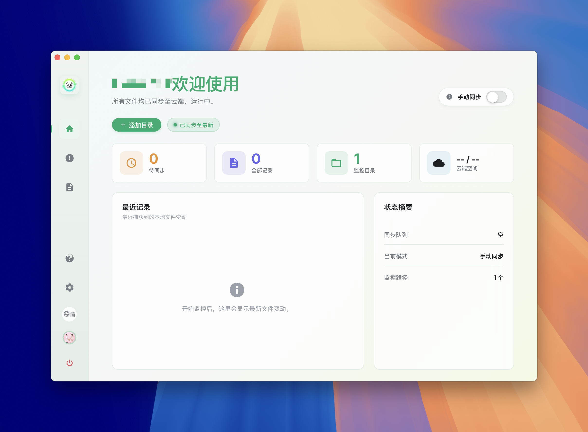
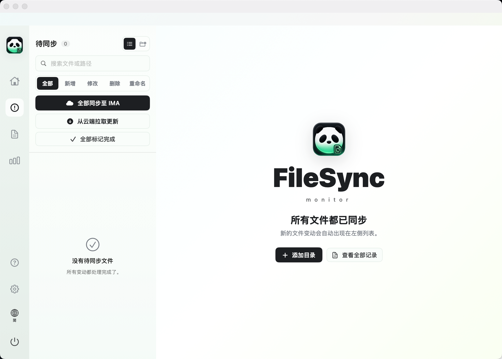
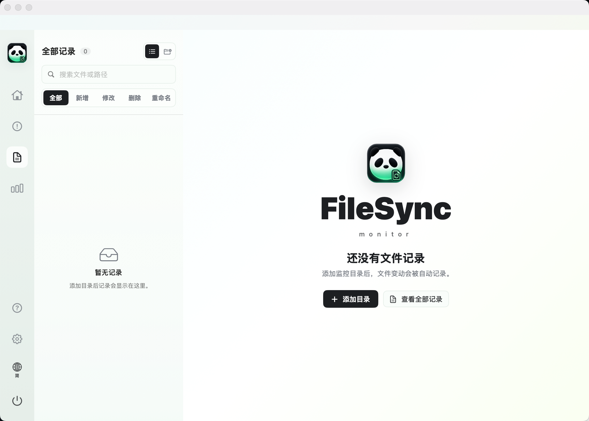
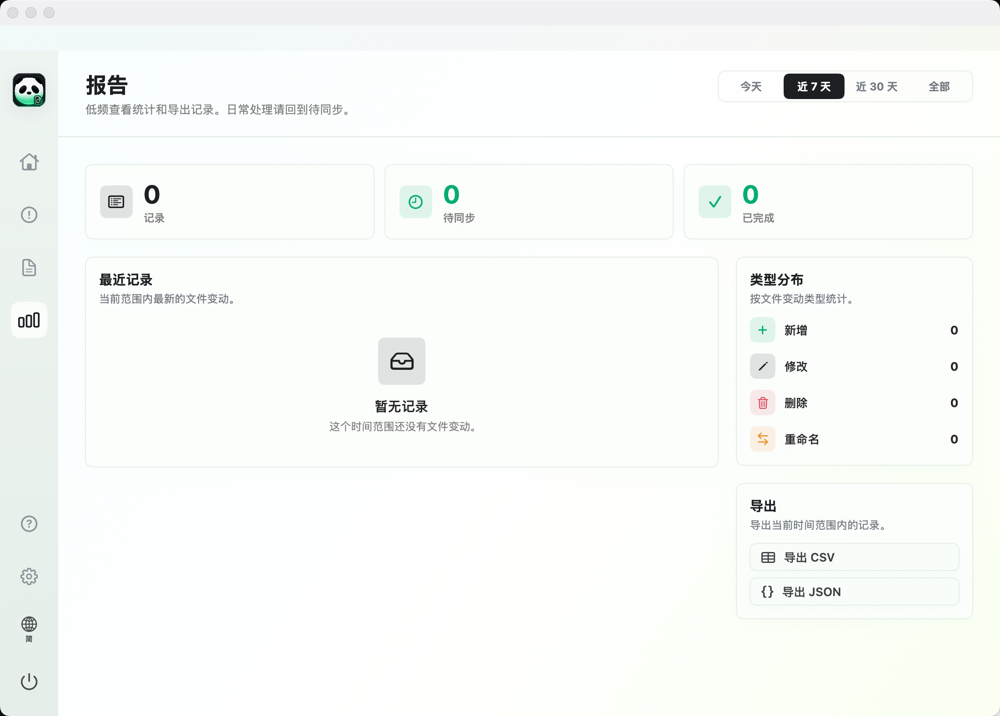
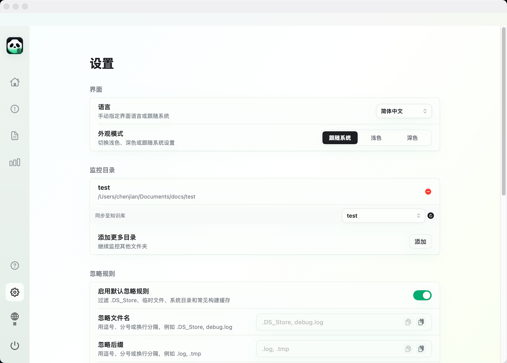
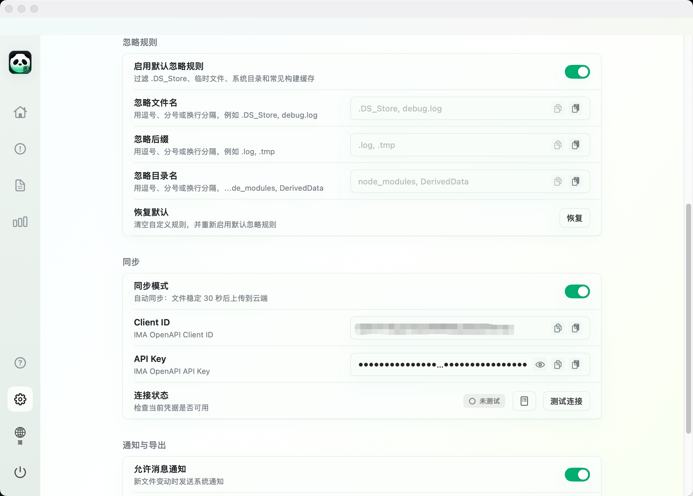
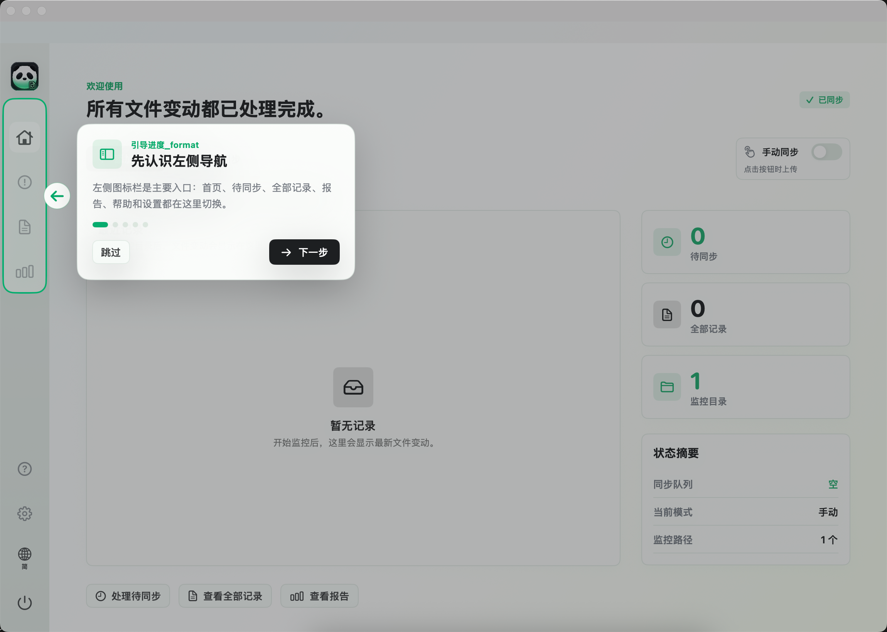
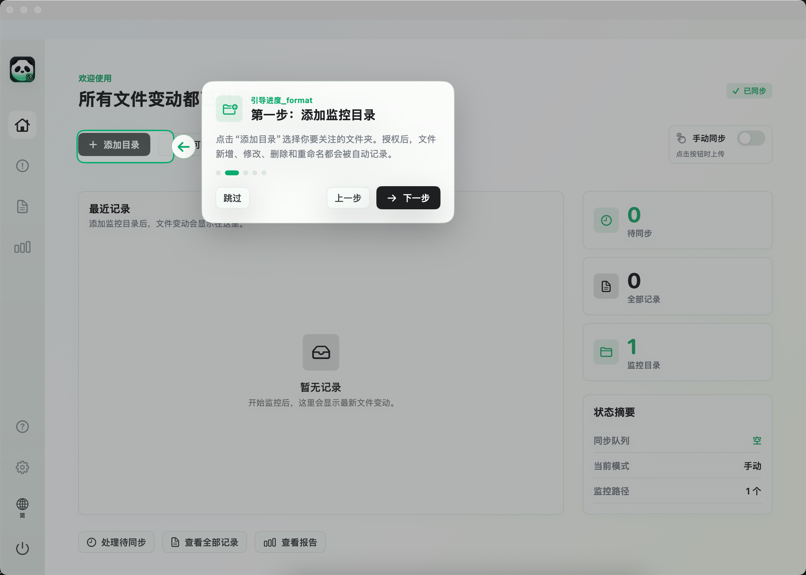

# FileSyncMonitor

[English](README_en.md) | [中文](README.md)
FileSyncMonitor 是一款 macOS 文件变动监控与同步确认工具。它可以监控指定目录的文件变化，记录新增、修改、删除、重命名事件，并通过主窗口、菜单栏角标和系统通知提醒用户处理待同步文件。

当前版本使用 SwiftUI + SwiftData 构建，底层监控基于 macOS FSEvents，支持本地报告导出和可选的腾讯 IMA 云端上传。

## 🖥️ 界面预览

### 📊 核心看板与同步流
| 首页 (Dashboard) | 待同步 (Pending Sync) |
| --- | --- |
|  |  |

### 📈 记录明细与统计分析
| 全部记录 (All Records) | 统计报告 (Reports) |
| --- | --- |
|  |  |

### ⚙️ 系统设置与同步规则
| 常规设置 (Settings) | 规则与云端配置 (Settings 2) |
| --- | --- |
|  |  |

### ❓ 新手指引与帮助关于
| 帮助与关于 (FAQ & About) | 新手指引 - 第一步 (Onboarding 1) | 新手指引 - 第二步 (Onboarding 2) |
| --- | --- | --- |
|  |  |  |

## 功能特性

- **目录监控**：支持添加多个目录，递归监控文件和文件夹变动。
- **事件记录**：记录路径、类型、时间、同步状态等信息，并持久化到本地 SwiftData。
- **待同步确认**：新事件默认进入待同步状态，可逐条或批量标记完成。
- **菜单栏入口**：常驻菜单栏，显示待同步数量，并提供最近待处理记录。
- **报告导出**：按时间范围统计记录，支持导出 CSV 和 JSON。
- **IMA 云端集成**：配置 Client ID 与 API Key 后，可将文件上传到 IMA。
- **忽略规则**：默认过滤 `.DS_Store`、临时文件、系统目录、构建缓存等噪声文件，也支持在设置页自定义文件名、后缀和目录名。
- **现代桌面界面**：采用 FileSync 首页、极窄图标栏、二级列表侧栏和浅色氛围背景。

## 系统要求

- macOS 14.0 Sonoma 或更高版本
- Swift 5.9+
- Xcode 15+ 或 Swift Package Manager

## 快速开始

```bash
swift build
swift run
```

运行后：

1. 打开主窗口或菜单栏应用。
2. 在首页或设置页添加需要监控的目录。
3. 修改、创建或删除目录中的文件。
4. 在“待同步”页面确认事件，并按需标记完成、上传到 IMA 或导出记录。

## 开发命令

```bash
# 调试构建
swift build

# 运行应用
swift run

# 运行测试
swift test

# 发布构建
swift build -c release
```

> 当前测试目标已配置，但项目暂未补充自动化测试用例。

## 忽略规则

忽略规则在事件入库前执行。被忽略的文件不会生成记录、不会触发通知，也不会增加菜单栏角标。

默认忽略项包括：

- 文件名：`.DS_Store`、`Icon\r`、`.localized`、`Thumbs.db`、`desktop.ini`
- 临时文件：`~$*`、`.tmp`、`.temp`、`.swp`、`.swo`、`.part`、`.download`、`.crdownload`
- 系统目录：`.Trashes`、`.Spotlight-V100`、`.fseventsd`、`.TemporaryItems`
- 开发目录：`.git`、`.svn`、`.hg`、`node_modules`、`.next`、`.nuxt`、`dist`、`build`、`.build`、`DerivedData`
- IDE 与缓存目录：`.idea`、`.vscode`、`.swiftpm`、`.cache`

可以在“设置 > 忽略规则”中：

- 开启或关闭默认忽略规则。
- 添加自定义忽略文件名，例如 `debug.log`。
- 添加自定义忽略后缀，例如 `.log`、`.tmp`。
- 添加自定义忽略目录名，例如 `node_modules`、`DerivedData`。
- 恢复默认配置。

## IMA 云端配置

打开“设置 > IMA 云端”，填写：

- `Client ID`
- `API Key`

配置完成后可以测试连接，并在文件详情中点击“上传到 IMA”。当前上传使用默认知识库标识，后续可扩展为知识库选择器。

> 凭据目前通过 `@AppStorage` 保存到 UserDefaults。若用于生产环境，建议后续迁移到 Keychain。

## 项目结构

```text
.
├── Package.swift
├── Sources/FileSyncMonitor
│   ├── FileSyncMonitorApp.swift
│   ├── Models
│   │   └── FileEvent.swift
│   ├── Services
│   │   ├── FileMonitorService.swift
│   │   ├── PersistenceController.swift
│   │   ├── NotificationManager.swift
│   │   ├── ExportService.swift
│   │   ├── IMASyncService.swift
│   │   └── StoreManager.swift
│   ├── UI
│   │   ├── MainView.swift
│   │   ├── SettingsView.swift
│   │   ├── ReportsView.swift
│   │   ├── MenuBarManager.swift
│   │   └── Theme.swift
│   └── Resources
│       └── Localizable.xcstrings
├── Tests
└── docs
```

## 数据与隐私

- 文件事件记录保存在本机 SwiftData/SQLite 数据库中。
- 应用不会自动同步文件内容，除非用户在详情页主动点击“上传到 IMA”。
- 导出文件由用户通过保存面板选择位置。
- 监控目录权限通过 Security-Scoped Bookmarks 持久化。

## 已知限制

- 当前不做文件内容 diff，只记录文件系统事件。
- FSEvents 会合并短时间内的高频事件，事件粒度取决于系统回调。
- 已入库的历史记录不会因后续新增忽略规则而自动删除。
- IMA API 凭据尚未迁移到 Keychain。

## 💖 捐赠与支持

FileSyncMonitor 是一款完全开源且自愿使用的工具。如果它为您节省了时间，提升了工作效率，欢迎通过扫码进行捐赠支持，您的支持将是维护本项目持续更新的最佳动力！

| 微信捐赠 (WeChat Pay) | 支付宝捐赠 (Alipay) |
| --- | --- |
|  |  |

> 💡 捐赠完全自愿，所有功能均无限制提供。感谢您的支持！

