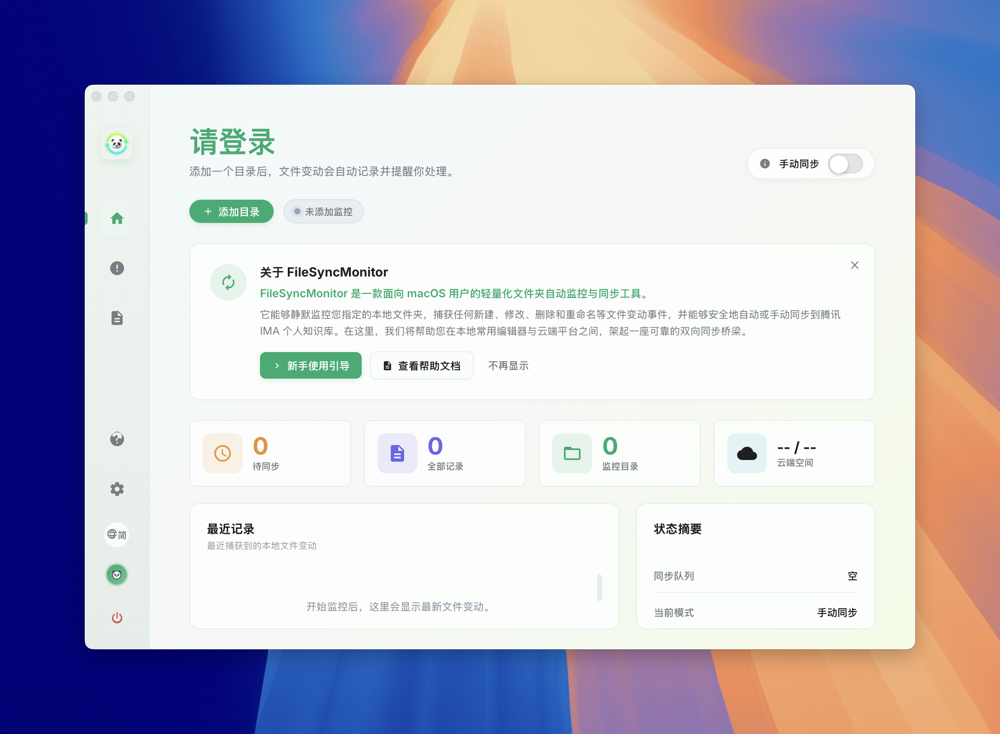
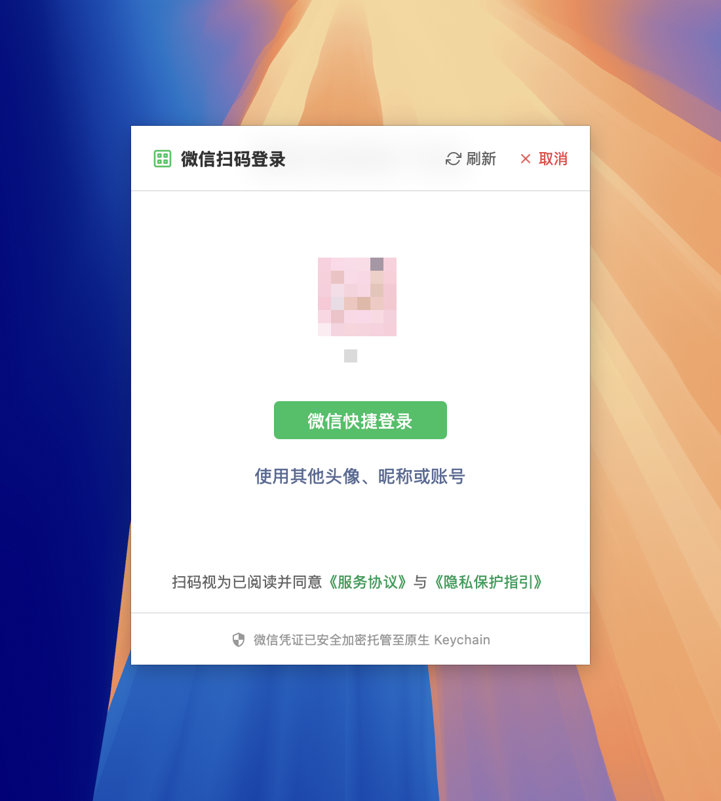
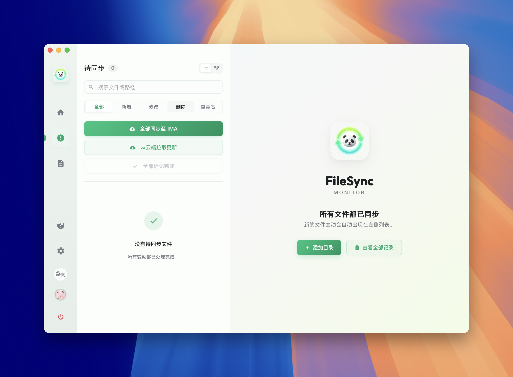
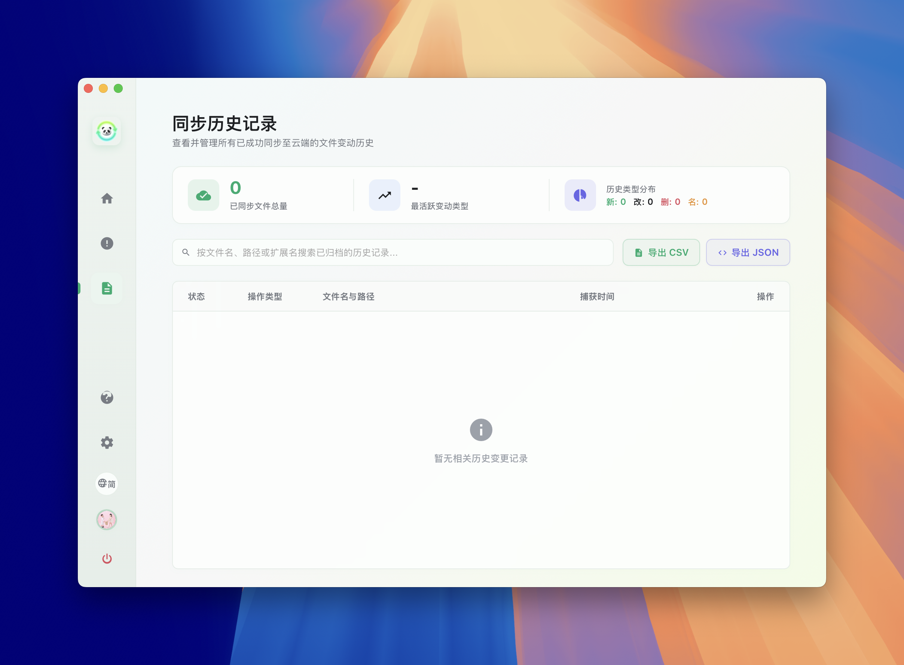
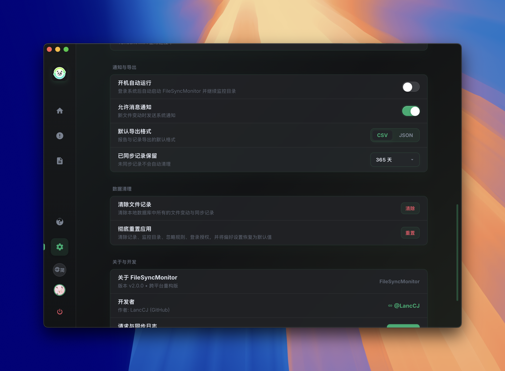
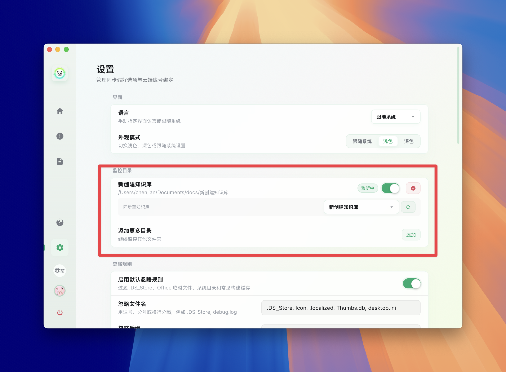
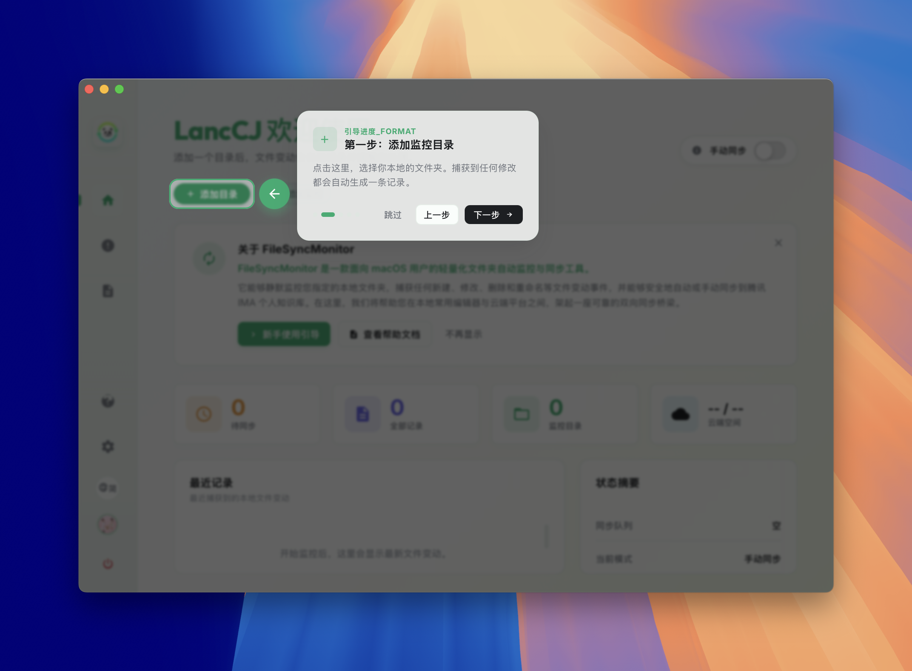

# FileSyncMonitor

[English](README_en.md) | [中文](README.md)

FileSyncMonitor is a cross-platform desktop tool for monitoring local file changes and confirming sync tasks. The current codebase has moved from the old SwiftUI-only app to a **Tauri 2 + Rust backend + vanilla HTML/CSS/JS frontend** architecture, designed for macOS and Windows.

It monitors configured directories for create, modify, delete, and rename events, stores records in local SQLite, and helps users process pending sync tasks from the main window and system tray. It also integrates with Tencent IMA knowledge bases through QR-code login and supports local-to-cloud, cloud-to-local, and bidirectional sync flows.

## UI Screenshots

### Dashboard And Sync

| Initialization | WeChat Login |
| --- | --- |
|  |  |

| Home | Pending Sync |
| --- | --- |
|  |  |

### Records And Reports

| All Records | Dark Mode |
| --- | --- |
|  |  |

### Settings And Sync Rules

| Settings | Directory Binding |
| --- | --- |
|  |  |

### Onboarding And Help

| Help & About | Onboarding Guide | Feature Guide |
| --- | --- | --- |
|  |  |  |

## Features

- **Cross-platform desktop architecture**: Tauri 2 owns the desktop shell, tray, windows, packaging, and IPC.
- **Rust file watcher core**: recursive directory watching through `notify`, with 2-second debounce and event coalescing.
- **Local SQLite storage**: file events and app config are stored in a local SQLite database.
- **Event records**: path, old path, event type, timestamp, sync status, directory flag, and remote ID.
- **Pending sync queue**: new changes are pending by default and can be marked or synced individually, by folder, or in bulk.
- **Manual and automatic sync**: users can trigger sync manually; auto sync attempts to process bound directories after detected changes.
- **Tencent IMA sync**: WeChat QR login, knowledge base list, directory binding, upload, cloud pull, folder creation, rename, and delete API adaptation.
- **Cloud path mapping**: each monitored directory can bind to an IMA knowledge base, with local subfolders mapped to remote folders.
- **Ignore rules**: filters system files, temporary files, build outputs, cache folders, and custom names/extensions/directories.
- **System tray**: open main window, sync all directories, and quit.
- **Request logs**: recent IMA HTTP requests and responses are kept in memory for troubleshooting.
- **CSV/JSON export**: synced history can be exported from the frontend.
- **Bilingual UI**: Simplified Chinese and English strings are included.

## Architecture

```text
                    ┌──────────────────────────────────────┐
                    │ desktop-portal Web UI                │
                    │ HTML / CSS / Vanilla JS              │
                    │ state, rendering, settings, i18n     │
                    └──────────────────┬───────────────────┘
                                       │ Tauri invoke/listen
                    ┌──────────────────▼───────────────────┐
                    │ sync-kernel Rust Backend              │
                    │ commands, SQLite, notify, tray, IMA   │
                    └──────┬────────────┬────────────┬──────┘
                           │            │            │
                     SQLite DB     OS file events   IMA Web APIs
```

### Frontend

- `desktop-portal/index.html`: single-page app structure.
- `desktop-portal/main.js`: app state, Tauri commands, event listeners, rendering.
- `desktop-portal/styles.css`: desktop UI styles, theme variables, layout.
- `desktop-portal/i18n.js`: English translation dictionary.

### Backend

- `sync-kernel/src/lib.rs`: Tauri setup, command registration, sync orchestration, login windows, silent refresh.
- `sync-kernel/src/db.rs`: SQLite schema plus event/config CRUD.
- `sync-kernel/src/monitor.rs`: directory watching, ignore rules, debounce/coalescing, event insertion.
- `sync-kernel/src/ima_sync.rs`: IMA client, knowledge bases, upload/download, folders, delete, rename.
- `sync-kernel/src/credentials.rs`: IMA credential loading, saving, and clearing.
- `sync-kernel/src/tray.rs`: system tray menu and click behavior.

## Quick Start

### Requirements

- Node.js 18+
- Rust stable
- A desktop environment supported by Tauri 2
- macOS or Windows

### Install Dependencies

```bash
npm install
```

### Run In Development

```bash
npm run dev
```

This enters `sync-kernel` and starts `tauri dev`.

### Build App Bundle

```bash
npm run build
```

### Check Rust Backend

```bash
cd sync-kernel
cargo check
```

## GitHub Automated Packaging

The repository includes a GitHub Actions workflow:

```text
.github/workflows/release-tauri.yml
```

Trigger options:

- Push a version tag, for example `v1.2.0`.
- Run `Release Tauri App` manually from the GitHub Actions page.

Build targets:

- macOS Apple Silicon: `aarch64-apple-darwin`
- macOS Intel: `x86_64-apple-darwin`
- Windows x64

The workflow uses the official `tauri-apps/tauri-action` to build installers and create/update a draft GitHub Release. Review the generated assets and notes on GitHub before publishing the release.

Example:

```bash
git tag v1.2.0
git push origin v1.2.0
```

## Data And Config

- File events are stored in `file_sync_monitor.db` under the Tauri app data directory.
- Config values are stored in the SQLite `app_config` table; some frontend preferences are mirrored in `localStorage`.
- IMA credentials are currently stored as `ima_credentials.json` under the Tauri app data directory, with migration from the old temp-file path.
- HTTP request logs are in-memory only and capped at 100 entries.
- Export files are generated by the frontend.

## Event Flow

1. The frontend reads saved monitored directories.
2. The frontend calls `start_file_monitor`.
3. The Rust backend starts recursive `notify` watchers.
4. Raw events are filtered by ignore rules.
5. Events enter a 2-second debounce/coalescing window.
6. Resolved events are inserted into SQLite.
7. The backend emits `file-change-events`.
8. The frontend refreshes home stats, pending records, all records, and detail panels.

## Sync Flow

1. The user binds monitored directories to IMA knowledge bases.
2. Manual sync is triggered, or auto sync runs after detected changes.
3. The backend pauses file watching to avoid feedback loops.
4. Pull phase reads the remote knowledge tree, creates local folders, and downloads files.
5. Push phase scans local pending events, creates remote folders, or uploads files.
6. Successful records are marked synced and updated with `remote_id`.
7. The backend resumes watching and emits sync progress to the frontend.

## Ignore Rules

Default ignored items include:

- File names: `.DS_Store`, `Icon\r`, `.localized`, `Thumbs.db`, `desktop.ini`
- Temporary prefixes: `~$`, `._`, `~wrl`, `~df`, `~rf`
- Temporary extensions: `asd`, `lck`, `lock`, `tmp`, `temp`, `swp`, `swo`, `part`, `download`, `crdownload`
- System directories: `.Trashes`, `.Spotlight-V100`, `.fseventsd`, `.TemporaryItems`
- Development directories: `.git`, `.svn`, `.hg`, `node_modules`, `.next`, `.nuxt`, `dist`, `build`, `.build`, `DerivedData`
- IDE/cache directories: `.idea`, `.vscode`, `.swiftpm`, `.cache`

The Settings page can enable/disable default rules and customize ignored file names, extensions, and directory names.

## Tencent IMA Sync

The app opens Tencent IMA login in an embedded Tauri WebView and injects login-response capture code to save required credentials. The sync layer adapts IMA Web/H5 APIs and supports:

- User profile and quota lookup.
- Knowledge base listing.
- Knowledge tree listing.
- Remote folder creation.
- Local file upload to knowledge base folders.
- Remote file or note download to local disk.
- Remote rename and delete attempts.
- Silent token refresh when credentials expire.

> IMA cloud sync depends on unofficial interfaces and may break if server behavior changes. See [docs/IMA抓包接口总结.md](docs/IMA抓包接口总结.md) for sanitized packet-analysis notes.

## Project Structure

```text
.
├── package.json
├── package-lock.json
├── desktop-portal/
│   ├── index.html
│   ├── main.js
│   ├── styles.css
│   ├── i18n.js
│   └── assets/
├── sync-kernel/
│   ├── Cargo.toml
│   ├── Cargo.lock
│   ├── tauri.conf.json
│   ├── build.rs
│   ├── capabilities/
│   ├── permissions/
│   ├── icons/
│   └── src/
│       ├── main.rs
│       ├── lib.rs
│       ├── db.rs
│       ├── monitor.rs
│       ├── ima_sync.rs
│       ├── credentials.rs
│       └── tray.rs
├── docs/
└── scripts/
```

## Known Limitations

- There is no automated test coverage yet; validate with real folders and a real IMA knowledge base before release.
- IMA sync uses unofficial APIs and depends on Tencent server behavior.
- Credentials are currently stored as a local JSON file and have not yet been moved to cross-platform Keyring/OS credential storage.
- The system tray does not yet display a dynamic pending-count badge.
- The app records filesystem events only and does not perform file content diffs.
- `notify` and OS-level event streams may coalesce high-frequency changes.
- Historical records already in SQLite are not automatically removed when new ignore rules are added.

## Donation And Support

FileSyncMonitor is open source. If it saves you time, donations are welcome to support ongoing maintenance.

| WeChat Pay | Alipay |
| --- | --- |
|  |  |

Donations are completely voluntary and do not affect feature access.

## Disclaimer

This software and source code are intended for learning, research, and personal technical exchange. Tencent IMA cloud sync is adapted from unofficial interfaces. The author is not affiliated with Tencent Holdings Ltd. or any of its affiliates. Interfaces may stop working at any time, and users are responsible for account, data, API-change, and compliance risks.

The software is provided as is, without warranty of any kind. The author is not liable for any direct or indirect damages arising from use of the software or cloud sync features.

## License

This project is licensed under the [GPL-3.0](LICENSE) license.
